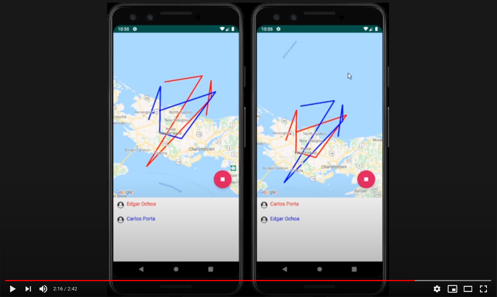

## Search Party

## Demo

## Description:

Search and rescue party companion app. The app will create an instance
of the SearchParty which will then provide the host with a sharable token/link.
This can then be input by any other of the party volunteers to join the instance.
The app will ping the gps location periodically so that it can trace on a Google Map
where the user has been already. This location will then be used with other user's locations
To create composite route that shows where all of the users in the SearchParty have been.
In this way, users can keep track of where everyone has searched and can focus on areas that
have not yet been visited.

## Main features

- Create a new search party giving a name and a code to join.
- Join with a code an already existing party.
- Start the party an display a map with the location of each party member.
- Login and authorization via firebase.
